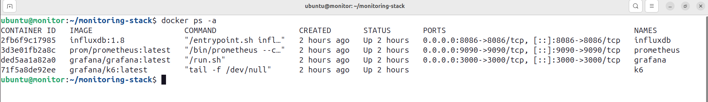
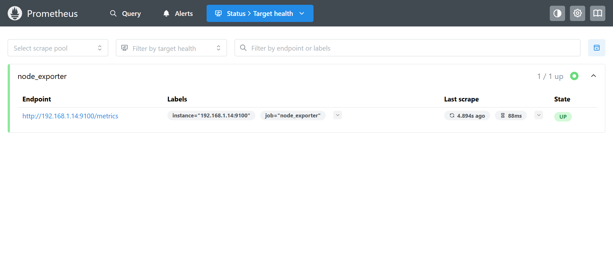
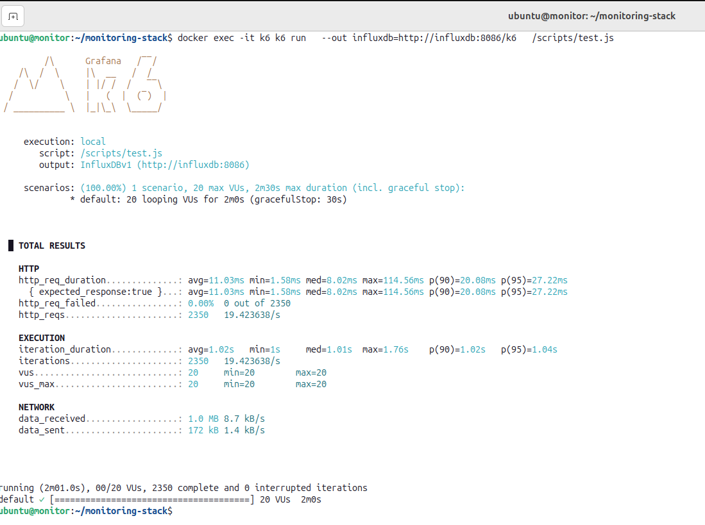

# Monitoring Stack: Grafana, Prometheus & k6

## Description

This project provides a **complete monitoring and load testing environment** using Grafana, Prometheus, InfluxDB, and k6. It enables real-time metrics collection, performance analysis, and interactive dashboards.

The setup is distributed across two virtual machines:

* **VM1 (192.168.1.14)** → Hosts the application and Node Exporter
* **VM2 (192.168.1.13)** → Hosts Prometheus, Grafana, InfluxDB, and k6

---

## Architecture Overview

| Component     | Role                                     |
| ------------- | ---------------------------------------- |
| Node Exporter | Collects system metrics (CPU, RAM, Disk) |
| Application   | Target system under test                 |
| Prometheus    | Scrapes metrics                          |
| Grafana       | Visualizes data                          |
| InfluxDB      | Stores k6 results                        |
| k6            | Performs load testing                    |

---

## 1. Prerequisites

### Docker & Docker Compose

```bash
sudo apt update
sudo apt install -y docker.io docker-compose
sudo systemctl enable docker
sudo systemctl start docker
```

---

## 2. VM1 Setup

### Node Exporter

* [Docker Compose File](node-exporter/docker-compose.yml)

```bash
cd ~/node-exporter
docker compose up -d
```

Check metrics:

```bash
curl http://192.168.1.14:9100/metrics
```

#### Log file – Node Exporter Metrics

[Node Exporter Metrics](docs/metrics.log)

---

### Application

* [Docker Compose File](app/docker-compose.yml)

```bash
cd ~/app
docker compose up -d
```

---

## 3. VM2 Setup

### Monitoring Stack

* [Docker Compose File](monitoring-stack/docker-compose.yml)

```bash
cd ~/monitoring-stack
docker compose up -d
```

#### Screenshot – Monitoring Stack Running



---

### Prometheus

* [Prometheus Config](monitoring-stack/prometheus/prometheus.yml)

#### Screenshot – Prometheus Targets UP



---

### Grafana Data Sources

* [Datasource Config](monitoring-stack/grafana/provisioning/datasources/datasource.yml)

#### Screenshot – Grafana Data Sources

[Grafana Data Sources](docs/grafana-datasources.png)

---

### Grafana Dashboards

Access Grafana:

```
http://192.168.1.13:3000
```

Import dashboards:

* ID **1860** (Node Exporter)
* ID **24720** (k6)

#### System Dashboard

[System Dashboard](docs/system-dashboard.png)

#### k6 Dashboard

[k6 Dashboard](docs/k6-dashboard.png)

---

### k6 Load Test

* [Test Scripts](monitoring-stack/k6/scripts/)

Run:

```bash
docker exec -it k6 k6 run \
--out influxdb=http://influxdb:8086/k6 \
/scripts/test-v1.js
```

#### Screenshot – k6 Run



---

## Versioned Load Tests

### Scripts

| Script       | Link                                                          | Type                 | VUs / Rate       | Duration |
|--------------|---------------------------------------------------------------|----------------------|------------------|----------|
| v1           | [test-v1.js](monitoring-stack/k6/scripts/test-v1.js)          | Baseline             | 20 VUs           | 2 min    |
| v2           | [test-v2.js](monitoring-stack/k6/scripts/test-v2.js)          | Load                 | 50 VUs           | 5 min    |
| v3           | [test-v3.js](monitoring-stack/k6/scripts/test-v3.js)          | Stress               | 100 VUs          | 10 min   |
| v4           | [test-v4.js](monitoring-stack/k6/scripts/test-v4.js)          | Ramp-Up              | 20 → 100 VUs     | 10 min   |
| v5           | [test-v5.js](monitoring-stack/k6/scripts/test-v5.js)          | Spike                | 20 → 200 → 20    | ~2 min   |

---

### Results

* [v1 result](monitoring-stack/k6/results/v1)
* [v2 result](monitoring-stack/k6/results/v2)
* [v3 result](monitoring-stack/k6/results/v3)
* [v4 result](monitoring-stack/k6/results/v4)
* [v5 result](monitoring-stack/k6/results/v5)

#### Result for v3

* [k6 Dashboard v3](monitoring-stack/k6/results/v3/k6-dashboard-v3.png)

* [System Dashboard v3](monitoring-stack/k6/results/v3/system-dashboard-v3.png)
  
* [Json Summary v3](monitoring-stack/k6/results/v3/test-v3-summary.json)
---

## Access URLs

| Service       | URL                                                  |
| ------------- | ---------------------------------------------------- |
| Prometheus    | [http://192.168.1.13:9090](http://192.168.1.13:9090) |
| Grafana       | [http://192.168.1.13:3000](http://192.168.1.13:3000) |
| InfluxDB      | [http://192.168.1.13:8086](http://192.168.1.13:8086) |
| Node Exporter | [http://192.168.1.14:9100](http://192.168.1.14:9100) |
| Application   | [http://192.168.1.14:8082](http://192.168.1.14:8082) |

---
